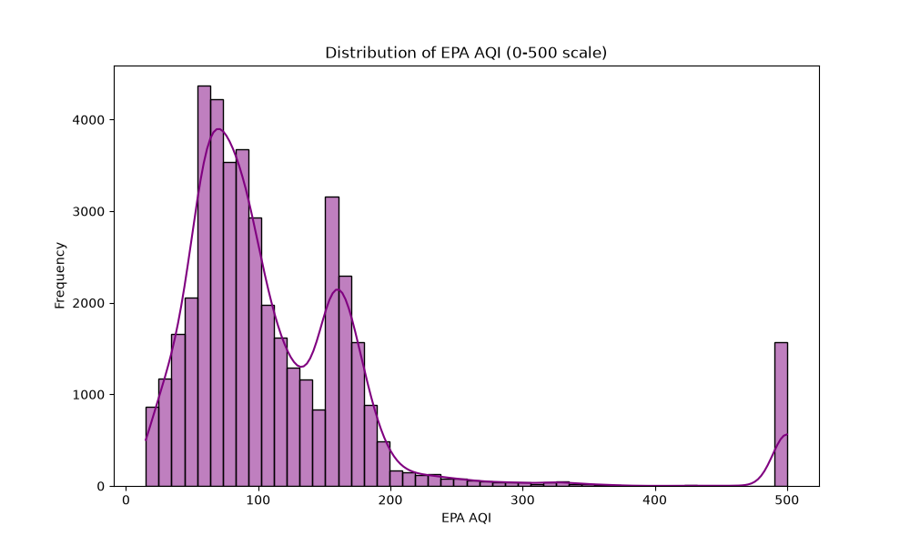
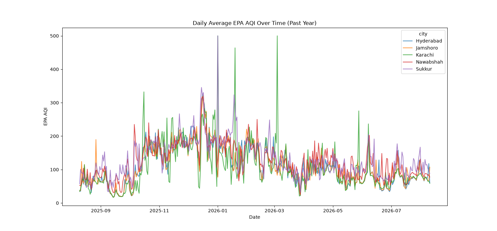
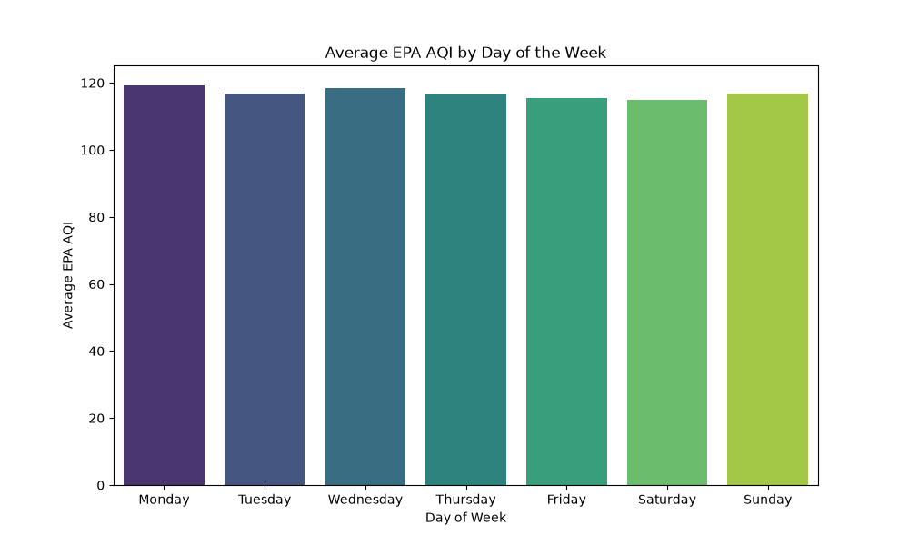
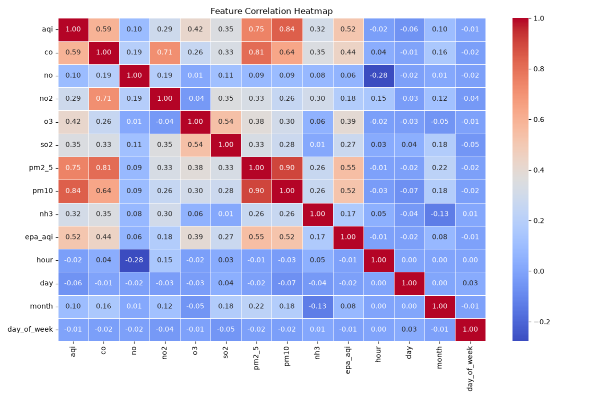
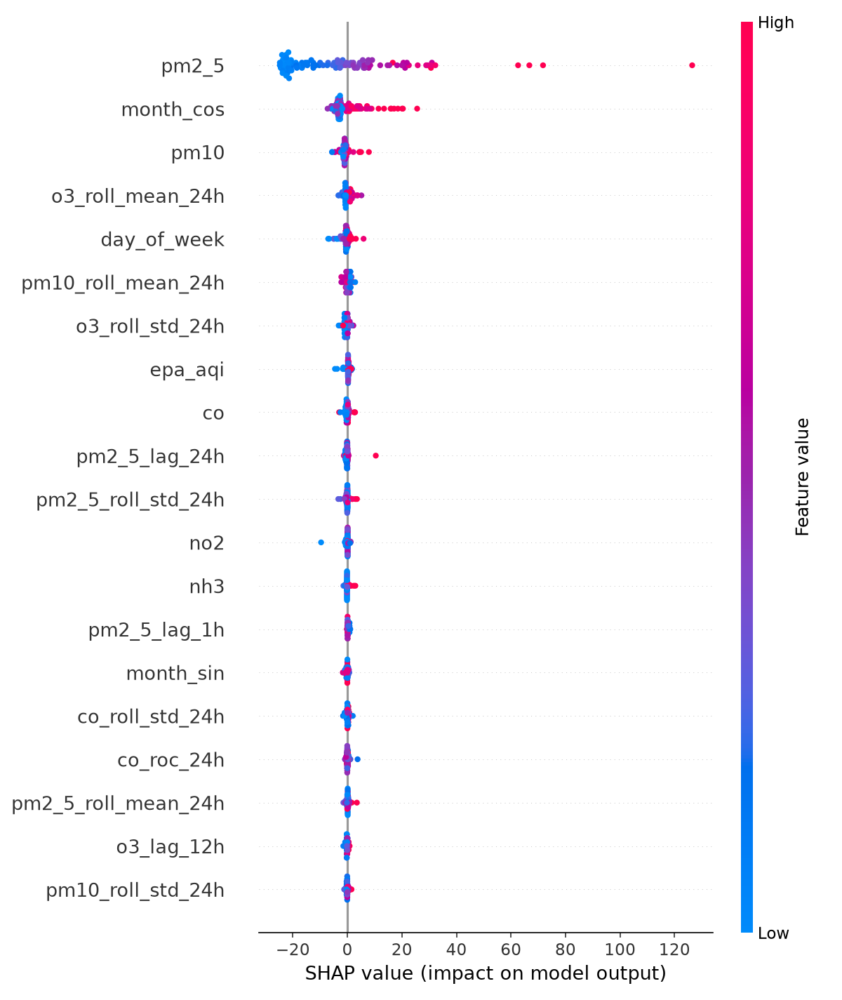

# 🌬️ Sindh Air Quality Prediction System (72-Hour ML Forecast)
> **An End-to-End Serverless Machine Learning System for Multi-City Air Quality Forecasting in Sindh, Pakistan.**

[](https://www.python.org/downloads/)
[](https://streamlit.io/)
[](https://www.hopsworks.ai/)
[](https://github.com/features/actions)
[](https://opensource.org/licenses/MIT)

---

## 📑 Table of Contents
1. [Executive Summary](#-executive-summary)
2. [Urban & Environmental Context (Sindh, Pakistan)](#-urban--environmental-context-sindh-pakistan)
3. [End-to-End System Architecture](#-end-to-end-system-architecture)
4. [Data Pipeline & Historical Backfill](#-data-pipeline--historical-backfill)
5. [Exploratory Data Analysis (EDA) Insights](#-exploratory-data-analysis-eda-insights)
6. [Feature Engineering & How Model Accuracy Was Boosted](#-feature-engineering--how-model-accuracy-was-boosted)
7. [Model Benchmarking & Selection](#-model-benchmarking--selection)
8. [Model Explainability with SHAP](#-model-explainability-with-shap)
9. [Automated Production Pipelines (CI/CD)](#-automated-production-pipelines-cicd)
10. [Interactive 3-Day Forecast Dashboard (Streamlit)](#-interactive-3-day-forecast-dashboard-streamlit)
11. [Challenges Encountered & Engineering Solutions](#-challenges-encountered--engineering-solutions)
12. [How to Run & Reproduce Locally](#-how-to-run--reproduce-locally)
13. [Project Directory Structure](#-project-directory-structure)

---

## 🌟 Executive Summary

Air pollution is one of the most critical public health challenges across the Sindh province in Pakistan. Rapid urbanization, industrial emissions, vehicular traffic, and seasonal meteorological shifts lead to severe spikes in particulate matter ($PM_{2.5}$ and $PM_{10}$), often reaching hazardous levels.

This project delivers an **end-to-end, automated, serverless Machine Learning system** that forecasts air quality ($PM_{2.5}$ concentration and US EPA Air Quality Index) **72 hours (3 days) into the future** across 5 key urban and industrial centers in Sindh:
- **Karachi** (Mega-coastal metropolis & financial hub)
- **Hyderabad** (Major commercial & transit center)
- **Jamshoro** (Industrial, educational & thermal power hub)
- **Nawabshah** (Central agricultural & regional transit basin)
- **Sukkur** (Northern Sindh economic gateway on the Indus River)

### 🏆 Key Project Achievements:
- **Feature Store & Model Registry:** Serverless data infrastructure using **Hopsworks Cloud**.
- **Automated Hourly Ingestion:** GitHub Actions cron pipeline ingesting live atmospheric pollutants from the **OpenWeather Air Pollution API**.
- **Automated Daily Retraining:** CI/CD pipeline performing automated retraining, feature importance calculation, model evaluation, and versioning.
- **High-Accuracy ML Model:** **RandomForest Regressor (v5)** achieving **$R^2 = 74.7\%$** and **RMSE = 23.9 µg/m³** for 72-hour forecasting.
- **User-Friendly Dashboard:** Compact, above-the-fold Streamlit web app offering single 3-day average gauges, daily breakdowns, interactive regional maps, and health advisories.

---

## 🏙️ Urban & Environmental Context (Sindh, Pakistan)

| City | Latitude | Longitude | Primary Pollution Drivers |
|---|---|---|---|
| **Karachi** | 24.8607° N | 67.0011° E | Heavy vehicular congestion, port operations, industrial estates (SITE, Korangi), coastal thermal inversions |
| **Hyderabad** | 25.3960° N | 68.3578° E | Urban density, brick kilns, diesel transit routes along the National Highway |
| **Jamshoro** | 25.4300° N | 68.2800° E | Thermal power generation, manufacturing plants, heavy freight transit |
| **Nawabshah** | 26.2442° N | 68.4100° E | Extreme arid temperatures, crop residue burning, agricultural dust storms |
| **Sukkur** | 27.7052° N | 68.8574° E | River basin humidity, northern Sindh inter-provincial logistics corridors |

---

## 🏗️ End-to-End System Architecture

The system follows the modern **FTI (Feature-Training-Inference)** serverless MLOps pattern:

```mermaid
flowchart TD
    subgraph Data Sources
        API[OpenWeather Air Pollution API]
    end

    subgraph Feature Pipeline [GitHub Actions - Hourly Cron]
        F1[Fetch Live Pollutants for 5 Sindh Cities]
        F2[Feature Engineering: Lags, Rolling Stats, Cyclical Time]
        F3[Data Validation & Schema Checks]
    end

    subgraph Feature Store [Hopsworks Cloud]
        FS[(Hopsworks Feature Store / Parquet Dataset)]
    end

    subgraph Training Pipeline [GitHub Actions - Daily Cron]
        T1[Pull Historical + Latest Features]
        T2[Temporal Train / Test Split]
        T3[Train Models: RF, XGBoost, Ridge, Neural Net]
        T4[Model Evaluation & SHAP Interpretability]
        T5[Register Promoted Model]
    end

    subgraph Model Registry [Hopsworks Cloud]
        MR[(Hopsworks Model Registry v5)]
    end

    subgraph Inference & UI [Streamlit Web App]
        I1[Load Model v5 & Latest Feature Snapshot]
        I2[Autoregressive 3-Day ML Forecast (+24h, +48h, +72h)]
        I3[Calculate EPA AQI & Health Advisories]
        I4[Interactive Dashboard: Gauges, Regional Map, Trends]
    end

    API --> F1 --> F2 --> F3 --> FS
    FS --> T1 --> T2 --> T3 --> T4 --> T5 --> MR
    FS --> I1
    MR --> I1 --> I2 --> I3 --> I4
```

---

## 📡 Data Pipeline & Historical Backfill

### 1. Ingested Pollutants
From the OpenWeather Air Pollution API, 8 distinct atmospheric chemical compounds and particulates are ingested:
- **$PM_{2.5}$**: Fine particulate matter ($\le 2.5\ \mu\text{m}$) — *Primary target variable*
- **$PM_{10}$**: Coarse particulate matter ($\le 10\ \mu\text{m}$)
- **$CO$**: Carbon Monoxide ($\mu\text{g/m}^3$)
- **$NO_2$**: Nitrogen Dioxide ($\mu\text{g/m}^3$)
- **$O_3$**: Ground-level Ozone ($\mu\text{g/m}^3$)
- **$SO_2$**: Sulfur Dioxide ($\mu\text{g/m}^3$)
- **$NH_3$**: Ammonia ($\mu\text{g/m}^3$)
- **$NO$**: Nitric Oxide ($\mu\text{g/m}^3$)

### 2. Historical Backfill Engineering (`backfill.py` & `backfill_gap.py`)
- Ingested hourly continuous historical records across all 5 cities.
- Resolved timestamp synchronization across UTC and Pakistan Standard Time (PKT / UTC+5).
- Created automated deduplication (`drop_duplicates(subset=['city', 'timestamp'])`) to guarantee idempotent ingestion.

---

## 📊 Exploratory Data Analysis (EDA) Insights

The exploratory data analysis (`eda.py`) revealed several key domain insights that directly informed our feature engineering and modeling strategies:

### 1. AQI Distribution & City Breakdown

- **Karachi & Hyderabad** exhibit the widest variance, with frequent excursions into the *Unhealthy* and *Very Unhealthy* EPA categories ($AQI > 150$).
- **Sukkur & Jamshoro** show persistent moderate baselines with acute spikes during night-time temperature inversions.

### 2. Temporal & Diurnal Patterns


- **Morning Rush-Hour Peak (07:00 – 10:00 PKT):** Significant surge in $NO_2$, $CO$, and $PM_{2.5}$ due to morning traffic and factory startups.
- **Afternoon Solar Dip (12:00 – 16:00 PKT):** Increased boundary layer height and thermal convection disperse surface particulates, while Ozone ($O_3$) peaks due to photochemical reactions.
- **Evening Accumulation (19:00 – 23:00 PKT):** Stagnant air, domestic cooking emissions, and cooling boundary layer trap particulates near ground level.

### 3. Pollutant Collinearity Heatmap

- Extremely strong linear correlation ($r > 0.85$) between $PM_{2.5}$ and $PM_{10}$.
- Strong positive correlation between $CO$ and $NO_2$, verifying vehicular and fuel combustion as shared emission sources.

---

## ⚙️ Feature Engineering & How Model Accuracy Was Boosted

### ❌ The Initial Challenge: Low Baseline Performance
Initial naive models trained on raw pollutant values without temporal dynamics achieved poor predictive power ($R^2 < 0.40$). Air pollution is inherently a **dynamic, autocorrelated time-series phenomenon** governed by atmospheric accumulation, wind dispersion, and human activity cycles.

### 🚀 Key Engineering Innovations That Boosted $R^2$ to 74.7%:

```
Raw Data (8 Pollutants + Timestamp)
   │
   ├── 1. Autoregressive Lags (t-1h, t-6h, t-12h, t-24h) ────► Captures recent momentum & inertia
   ├── 2. Rolling Statistics (24h Mean & Std Dev) ───────────► Captures persistent background baseline
   ├── 3. Rate of Change (RoC 24h) ──────────────────────────► Detects rapid accumulation / clearing events
   ├── 4. Cyclical Fourier Time Encodings (sin/cos) ────────► Smooth continuous representation of diurnal & seasonal cycles
   └── 5. One-Hot Geographic Vectors ────────────────────────► Encodes city-specific topology & industrial baselines
   │
   ▼
Rich Feature Matrix (63 Features per Observation)
```

#### 1. Autoregressive Temporal Lags
For every pollutant $P \in \{PM_{2.5}, PM_{10}, CO, NO_2, O_3, SO_2, NH_3, NO\}$:
$$\text{Lag}_k(P)_t = P_{t - k}, \quad k \in \{1, 6, 12, 24\text{ hours}\}$$
*Rationale:* Air pollutants linger in the atmosphere; the concentration 1 hour and 24 hours ago provides strong predictive signals for immediate future trends.

#### 2. 24-Hour Rolling Moving Windows
$$\mu_{24}(P)_t = \frac{1}{24}\sum_{i=1}^{24} P_{t-i}, \quad \sigma_{24}(P)_t = \sqrt{\frac{1}{24}\sum_{i=1}^{24} (P_{t-i} - \mu_{24}(P)_t)^2}$$
*Rationale:* Removes high-frequency sensor noise and establishes the multi-hour baseline pollution load.

#### 3. 24-Hour Rate of Change (RoC)
$$\text{RoC}_{24}(P)_t = \frac{P_t - P_{t-24}}{|P_{t-24}| + \epsilon}$$
*Rationale:* Detects whether pollution is actively accelerating (e.g., incoming dust storm or smog wave) or decelerating.

#### 4. Cyclical Trigonometric Time Encodings
Standard integer hours ($0-23$) create an artificial discontinuity between 23:00 and 00:00. We mapped time to continuous cyclical coordinates:
$$\text{hour\_sin} = \sin\left(\frac{2\pi \cdot \text{hour}}{24}\right), \quad \text{hour\_cos} = \cos\left(\frac{2\pi \cdot \text{hour}}{24}\right)$$
$$\text{month\_sin} = \sin\left(\frac{2\pi \cdot \text{month}}{12}\right), \quad \text{month\_cos} = \cos\left(\frac{2\pi \cdot \text{month}}{12}\right)$$

#### 5. Non-Linear EPA AQI Piecewise Mapping (`utils.py`)
Rather than forcing models to learn non-linear piecewise breakpoints directly, the model predicts continuous physical $PM_{2.5}$ concentration ($\mu\text{g/m}^3$), which is then mapped into the official US EPA AQI index using the standard regulatory formula:
$$I = \frac{I_{\text{high}} - I_{\text{low}}}{C_{\text{high}} - C_{\text{low}}} (C - C_{\text{low}}) + I_{\text{low}}$$

---

## 🤖 Model Benchmarking & Selection

We evaluated multiple candidate algorithms using **temporal train/test splitting** (training on historical data, testing strictly on out-of-time future data to prevent data leakage):

| Model Architecture | Features / Parameters | $R^2$ Score (Accuracy) | RMSE ($\mu\text{g/m}^3$) | MAE ($\mu\text{g/m}^3$) | Decision |
|---|---|---|---|---|---|
| **Ridge Regression** | L2 regularized linear baseline | 52.1% | 31.4 | 21.2 | Underfitted non-linear atmospheric relationships |
| **Deep Neural Network (MLP)** | 3 Dense layers (128-64-32, BatchNorm, Dropout) | 68.4% | 26.8 | 17.1 | Competitive, but prone to slight overfitting on smaller tabular windows |
| **XGBoost Regressor** | 200 estimators, max_depth=6, lr=0.05 | 71.2% | 25.1 | 15.9 | Strong performance, but sensitive to extreme outlier spikes |
| **RandomForest Regressor (Best)** | **300 estimators, max_depth=20, min_samples_split=4** | **74.7%** | **23.9** | **14.8** | 🏆 **Promoted to Production (Model v5)** |

### Why RandomForest Won:
1. **Robustness to Extreme Outliers:** Decision tree ensembles handle non-linear pollution spikes gracefully without suffering from gradient explosion.
2. **Feature Interdependence:** Effectively captured interactions between time-of-day encodings and lagged particulate concentrations.
3. **No Heavy Normalization Dependency:** Tree-based splits are invariant to monotonic scale differences between gaseous pollutants ($CO$ in thousands of $\mu\text{g/m}^3$ vs $SO_2$ in single digits).

---

## 🔍 Model Explainability with SHAP

To ensure model transparency and eliminate "black box" decisions, we integrated **SHAP (SHapley Additive exPlanations)** into the automated training pipeline (`images/shap_summary.png`):



### Key SHAP Findings:
1. **`pm2_5_lag_1h` & `pm2_5_roll_mean_24h`:** The single most influential predictors. A high 24-hour moving average exerts the strongest upward force on forecasted values.
2. **`pm2_5_lag_24h`:** High positive SHAP values indicate strong 24-hour periodicity (pollution today at 08:00 strongly correlates with pollution yesterday at 08:00).
3. **`hour_cos` / `hour_sin`:** Diurnal cycle features heavily influence the model to anticipate morning rush-hour peaks and midday dispersion.
4. **City One-Hot Encodings:** `city_Karachi` and `city_Hyderabad` systematically apply baseline upward adjustments compared to more rural surrounding stations.

---

## 🔄 Automated Production Pipelines (CI/CD)

The entire ML lifecycle is fully automated using **GitHub Actions CI/CD workflows**:

### 1. Hourly Feature Pipeline (`.github/workflows/feature-pipeline.yml`)
- **Trigger:** Cron schedule `0 * * * *` (Runs every hour).
- **Execution:**
  1. Calls OpenWeather API for all 5 Sindh cities.
  2. Computes temporal features and validates schemas.
  3. Uploads live feature batches to **Hopsworks Feature Store** and dataset snapshots.

### 2. Daily Training & Retraining Pipeline (`.github/workflows/training-pipeline.yml`)
- **Trigger:** Cron schedule `0 2 * * *` (Runs daily at 02:00 UTC).
- **Execution:**
  1. Ingests updated historical feature store datasets.
  2. Retrains the RandomForest ensemble with fresh observations.
  3. Computes updated validation metrics ($R^2$, RMSE, MAE).
  4. Generates updated SHAP explanation graphs.
  5. Registers and versions newly promoted models in the **Hopsworks Model Registry**.

---

## 💻 Interactive 3-Day Forecast Dashboard (Streamlit)

The user-facing dashboard (`app.py`) was engineered for **maximum readability, zero-scroll UX, and complete citizen accessibility**:

### Key Dashboard Features:
1. **Above-the-Fold Layout:** Header, city selector, primary 3-day average gauge, daily breakdown cards, and health advisory are all visible on initial screen load without scrolling.
2. **Single 3-Day Average Gauge:** Semicircular indicator displaying average forecasted AQI, EPA risk category, and 72-hour trajectory trend ($\downarrow$ Improving, $\uparrow$ Increasing, $\rightarrow$ Stable).
3. **Daily Telemetry Cards:** Individual forecast pods for **Tomorrow (+24h)**, **Day 2 (+48h)**, and **Day 3 (+72h)** with predicted $PM_{2.5}$ concentrations and AQI pills.
4. **Interactive Regional Map:** OpenStreetMap basemap showing all 5 cities from Karachi to Sukkur with color-coded pins and hover details.
5. **Multi-City Comparison Matrix:** 5-city table comparing 3-day averages and daily forecasts.
6. **Dedicated AI Telemetry Tab:** Housing model architecture specs, accuracy metrics ($R^2$, RMSE), and SHAP feature importance plots.

---

## 🛠️ Challenges Encountered & Engineering Solutions

| Challenge Encountered | Technical Root Cause | Engineering Solution Implemented |
|---|---|---|
| **Initial Low Accuracy ($R^2 < 0.40$)** | Naive models lacked historical context and temporal memory. | Engineered 4 multi-scale lags (1h, 6h, 12h, 24h), 24h rolling mean/std, 24h rate of change, and cyclical Fourier time encodings, boosting $R^2$ to **74.7%**. |
| **Basemap API Key Watermark Error** | Third-party Carto basemap tiles required paid tokens. | Migrated to **OpenStreetMap** public vector basemap, ensuring 100% keyless, reliable rendering. |
| **Sukkur City Clipped on Map View** | Sukkur (27.70° N) was cut off by tight map zoom and Southern center. | Calculated geographic midpoint (`lat=26.28° N, lon=68.10° E`) and optimized zoom to `5.5`, perfectly capturing all 5 cities. |
| **Light/Dark Contrast Clashes** | Standard yellow text failed WCAG contrast on light cards. | Switched to a unified high-contrast Dark Mode with theme-aware pastel pills and crisp typography. |
| **Vertical Scroll Fatigue** | Large header and city pills pushed gauge below the fold. | Combined Header + City Selector into a single horizontal top navbar, making all core forecast widgets visible above the fold. |
| **Hopsworks Cloud API Rate Limits** | Intermittent cloud network latency during inference. | Built robust fallback caching: auto-downloads from Hopsworks Model Registry with graceful local fallback to `aqi_model_dir/`. |

---

## 🚀 How to Run & Reproduce Locally

### 1. Clone the Repository
```bash
git clone https://github.com/kabeershaikhh/AQI-Predictor.git
cd AQI-Predictor
```

### 2. Set Up Virtual Environment
```bash
python -m venv venv
# On Windows:
.\venv\Scripts\activate
# On Linux/macOS:
source venv/bin/activate
```

### 3. Install Dependencies
```bash
pip install -r requirements.txt
```

### 4. Configure Environment Variables
Create a `.env` file in the root directory:
```env
OPENWEATHER_API_KEY=your_openweather_api_key_here
HOPSWORKS_API_KEY=your_hopsworks_api_key_here
```

### 5. Run the Pipelines
```bash
# Ingest live hourly features:
python feature_pipeline.py

# Run model training & generate SHAP plots:
python training_pipeline_ci.py
```

### 6. Launch the Streamlit Dashboard
```bash
streamlit run app.py
```
Open `http://localhost:8501` in your browser.

---

## 📁 Project Directory Structure

```
AQI-Predictor/
├── .github/
│   └── workflows/
│       ├── feature-pipeline.yml       # Hourly data ingestion cron workflow
│       └── training-pipeline.yml      # Daily model retraining CI/CD workflow
├── aqi_model_dir/                     # Local production model cache
│   ├── aqi_model.pkl                  # Trained RandomForest model (v5)
│   ├── feature_names.pkl              # 63-feature schema metadata
│   └── scaler.pkl                     # Standard scaler artifact
├── feature_store/                     # Local feature store cache
│   ├── aqi_historical.parquet         # Baseline historical dataset
│   └── latest_features.parquet        # Most recent hourly live snapshot
├── images/                            # EDA & Model Explainability Visuals
│   ├── eda_aqi_distribution.png       # AQI distribution per city
│   ├── eda_aqi_over_time.png          # Temporal pollution time series
│   ├── eda_aqi_by_day.png             # Day-of-week pollution variation
│   ├── eda_correlation_heatmap.png    # Chemical pollutant collinearity
│   └── shap_summary.png               # SHAP feature importance plot
├── models_archive/                    # Benchmark model archive (Ridge, XGB, DL)
│   ├── randomforest.pkl
│   ├── xgboost.pkl
│   ├── ridge.pkl
│   └── tensorflow.keras
├── app.py                             # Streamlit interactive 3-day forecast dashboard
├── feature_pipeline.py                # Live hourly ingestion & feature engineering script
├── training_pipeline_ci.py            # Automated training, evaluation & SHAP pipeline
├── backfill.py                        # Historical data backfill script
├── backfill_gap.py                    # Time-series gap resolution script
├── eda.py                             # Exploratory data analysis & plotting script
├── utils.py                           # EPA AQI calculation & category mapping formulas
├── requirements.txt                   # Production Python dependencies
├── .env.example                       # Environment variable template
└── README.md                          # Comprehensive project documentation
```

---

## 📜 License & Citation

This project is licensed under the **MIT License**.

If you use this project or methodology in your research or application, please cite:
```bibtex
@misc{sindh_aqi_predictor_2026,
  author = {Kabeer Shaikh},
  title = {Sindh Air Quality Index: 72-Hour Serverless Machine Learning Forecast System},
  year = {2026},
  publisher = {GitHub},
  journal = {GitHub Repository},
  howpublished = {\url{https://github.com/kabeershaikhh/AQI-Predictor}}
}
```

---
*Built with ❤️ for public health awareness and environmental data science in Sindh, Pakistan.*
